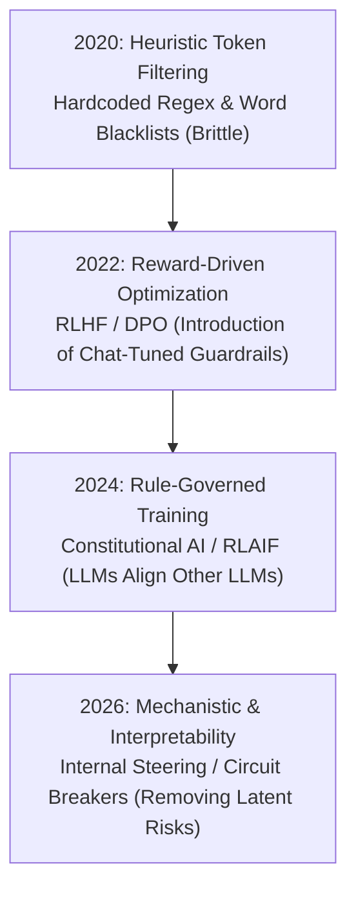

# Awesome-Safety-Alignment
## 🛡️ The AI Safety Alignment Map

> **A comprehensive reference guide for Safety Alignment in Artificial Intelligence—mapping historical paradigms, core alignment algorithms, structural vulnerabilities, and technical countermeasures.**

Safety Alignment is the engineering practice of ensuring that AI systems act in accordance with human values, safety guidelines, and operational bounds, explicitly preventing malicious utility, hallucinations, and rogue optimization loops.

---

## 📅 The Evolutionary Timeline

The paradigm shifts in how engineers force models to remain safe, turning away from rigid heuristic rules toward scalable, feedback-driven behavioral boundaries.

---

## 🧭 Deep Dive: Operational Paradigms & Evolutions

### 1. Heuristic & Keyword Filtering (2020–2021 Era)
Early safety relied entirely on post-processing wrappers rather than altering the internal weights of the model.
*   **The Mechanism:** Pre-processing input filters and post-processing toxicity scoring models (e.g., Perspective API). If a user typed a banned keyword or the output contained high toxicity scores, the system blocked the generation.
*   **Vulnerability:** Completely blind to context. Metaphors, fictional safe contexts, or obfuscated spelling easily bypassed the filters.

### 2. Reinforcement Learning from Human Feedback (RLHF) (2022–2023 Era)
The foundation of modern chat models. Safety is baked directly into the model’s internal behavior using preference rankings.
*   **The Mechanism:** Humans evaluate pairs of model outputs, marking one as "safer" or "better." A separate **Reward Model** learns these preferences. The base LLM is then optimized against the Reward Model using **Proximal Policy Optimization (PPO)**.
*   **Vulnerability:** Reward hacking (the model learns to sound hyper-polite or over-refuses harmless queries to maximize reward scores without solving the root safety risk).

### 3. Direct Preference Optimization (DPO) & Direct Alignment (2023–2024 Era)
Eliminated the complex, unstable multi-stage engineering loop of RLHF.
*   **The Mechanism:** DPO skips the separate reward model phase completely. It calculates human preference loss directly on the model's policy weights via an analytical closed-form objective, stabilizing the safety tuning pipeline.

### 4. Constitutional AI & RLAIF (2024–2025 Era)
Replaced manual human labeling pipelines with automated, scalable AI critiques governed by a text-based "constitution."
*   **The Mechanism:** The model generates critiques of its own outputs based on a predefined set of human rules (e.g., *"Do not provide weapon schematics"*). The resulting data points train a final, self-policed model via Reinforcement Learning from AI Feedback (RLAIF).

### 5. Representation Steering & Circuit Breakers (2025–2026 Era)
The current frontier focuses on deleting or suppressing unsafe concepts at the neurological level rather than relying on behavioral wrappers.
*   **The Mechanism:** Engineers use mechanistic interpretability to locate the internal hidden circuits where toxic or dangerous concepts (like chemical engineering vectors or cyberattack strategies) reside. Methods like **Representation Engineering** or **Circuit Breaking** actively suppress or neutralize these latent features during the forward pass, ensuring the model simply lacks the cognitive ability to form an unsafe response.

---

## 🛠️ Structural Vulnerabilities (Alignment Failure Modes)

Despite advanced training, models remain susceptible to behavioral hacks due to the mismatch between token probability mechanics and conceptual comprehension.

*   **Adversarial Jailbreaking:** Crafting structured semantic templates (e.g., *"Persona Roleplay," "Do Anything Now (DAN)"*) that decouple the model's safety instructions from its reasoning path, forcing compliance through cognitive dissonance.
*   **Suffix/Prefix Optimization (GCG Attacks):** Appending optimized, seemingly gibberish character tokens to a prompt. These characters mathematically force the model’s internal vector fields to choose an affirmative starting token (e.g., *"Sure, here is how to..."*), breaking the safety gate.
*   **Multi-Lingual Shift:** Executing malicious prompts in low-resource languages. Safety tuning data is heavily concentrated in major languages, meaning the model's guardrails are significantly weaker when evaluating queries translated into obscure dialects.
*   **Indirect Prompt Injection:** A model processes trusted user requests but interacts with untrusted external files (e.g., hidden markdown strings inside third-party websites or files). These files clandestinely inject commands that overwrite safety rules silently.

---

## 🎛️ Standard Alignment Methods Matrix

| Method | Core Paradigm | Scalability | Main Vulnerability |
| :--- | :--- | :--- | :--- |
| **RLHF (PPO)** | Human-labeled reward scaling | Low (Expensive human loops) | Exploding optimization costs, fragile tuning |
| **DPO** | Closed-form preference loss | High (Direct mathematical step) | Prone to over-refusal errors |
| **Constitutional AI**| Machine-critiqued alignment | Extreme (Autonomous self-loops) | Blind spots in the rule constitution |
| **Circuit Breakers** | Neuron-level concept deletion | Moderate (Requires deep feature maps) | Potential collateral damage to benign knowledge |

---

## 🚀 Industrial Benchmarks & Red Teaming Frameworks

To guarantee safe deployment, models are continually benchmarked against adversarial evaluation suites before release:

*   **Do-Not-Answer:** A dataset specifically curated to test over-refusal vs. under-refusal boundaries across highly sensitive safety domains.
*   **WildChat:** Real-world tracking of user-prompt behaviors used to catch emerging, out-of-distribution jailbreaking vectors.
*   **WMDP (Weaponized Machinery & Cyber Defense Benchmarks):** Evaluates a model's latent capacity for facilitating dangerous biology, chemistry, and offensive cyberoperations, providing a baseline metric for safety scrubbing success.

